## Exploratory Data Analysis (EDA)

Exploratory Data Analysis (EDA) was conducted to understand how **customer demographics, financial characteristics, and campaign variables influence the likelihood of subscribing to a term deposit**. The goal of this analysis is not only to identify statistical relationships, but also to derive **actionable insights that support marketing targeting decisions.**

The EDA proceeds in four stages:

1. Customer demographics

1. Financial profile 

1. Campaign and previous contact behavior

1. Customer segmentation and predictive ranking

These analyses collectively inform how marketing campaigns can **prioritize high-probability customers and avoid low-yield segments.**

## 1. Customer Demographics

### Age and Subscription Behavior

Age distribution was analyzed to determine whether different age groups exhibit different subscription patterns.

Key observations include:

* Customers aged **65 and above show the highest subscription rates**
 
* Customers aged **26-45 generate a large number of subscribers**, but their conversion rates are relatively moderate
 
* Younger segments such as **18-25 tend to show lower conversion rates**

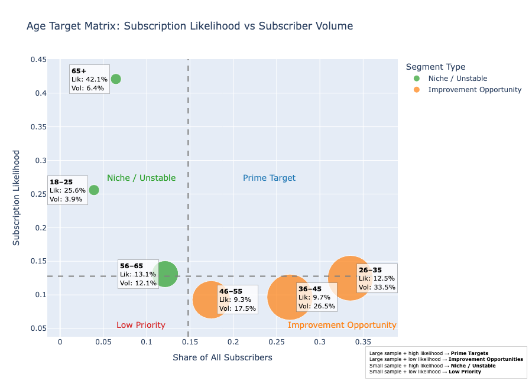

These results suggest that **age alone does not fully explain subscription behavior**, and that more informative patterns emerge when age is combined with other variables.

### Job Category and Subscription Behavior

Occupation was also evaluated to understand how professional status relates to subscription behavior.

Key findings include:

* **Retired customers show some of the highest conversion rates**

* **Students and unemployed individuals also show relatively strong conversion likelihood**
 
* However, these segments represent **smaller portions of the dataset**

Large occupational groups such as:

* management

* technicians
 
* blue-collar workers
 
* administrative staff

generate the majority of subscribers due to **their larger population sizes**, despite having moderate conversion rates.

This indicates that **small improvements in targeting within these large groups could produce meaningful gains in campaign effectiveness.**

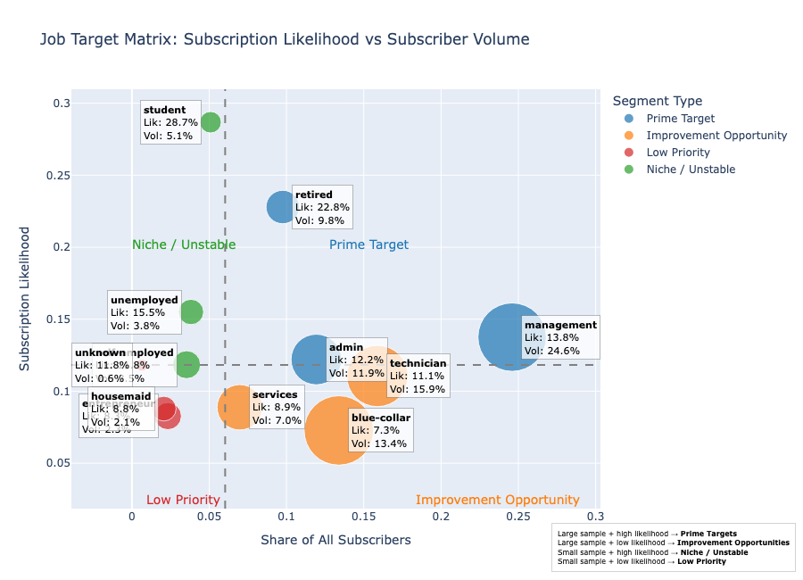

### Age × Job Interaction

To better understand demographic behavior, we analyzed the interaction between age group and occupation.

Several high-performing combinations emerge:

|Job	| Age Group |
|------------|--------------|
|Retired | 56–65, 65+ |
|Student |	18–25 |
|Unemployed |	56–65|

These segments combine **relatively high conversion rates with meaningful segment sizes**, making them potential target groups.

In contrast, large segments such as **blue-ollar workers aged 26-55** show moderate conversion rates but large populations, suggesting potential opportunities for **improved campaign messaging or targeting strategies**.

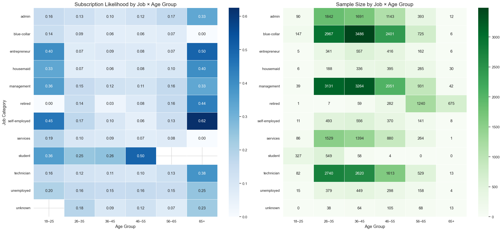

## 2. Financial Profile

Financial characteristics provide some of the strongest indicators of subscription likelihood.

### Account Balance

Account balance shows a strong relationship with subscription behavior.

Key observations:

* Customers with **higher account balances are significantly more likely to subscribe**

* Customers with **low balances show consistently lower conversion rates**

This suggests that **financial capacity is an important driver of willingness to invest in term deposits**.

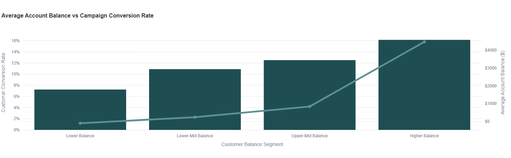

### Housing Loan Status

Housing loan status also influences subscription probability.

Key observations:

* Customers with **housing loans show lower subscription rates**

* Customers **without housing loans are significantly more likely to subscribe**

Housing loans likely represent a **financial commitment that reduces customers' willingness to allocate funds toward savings products.**

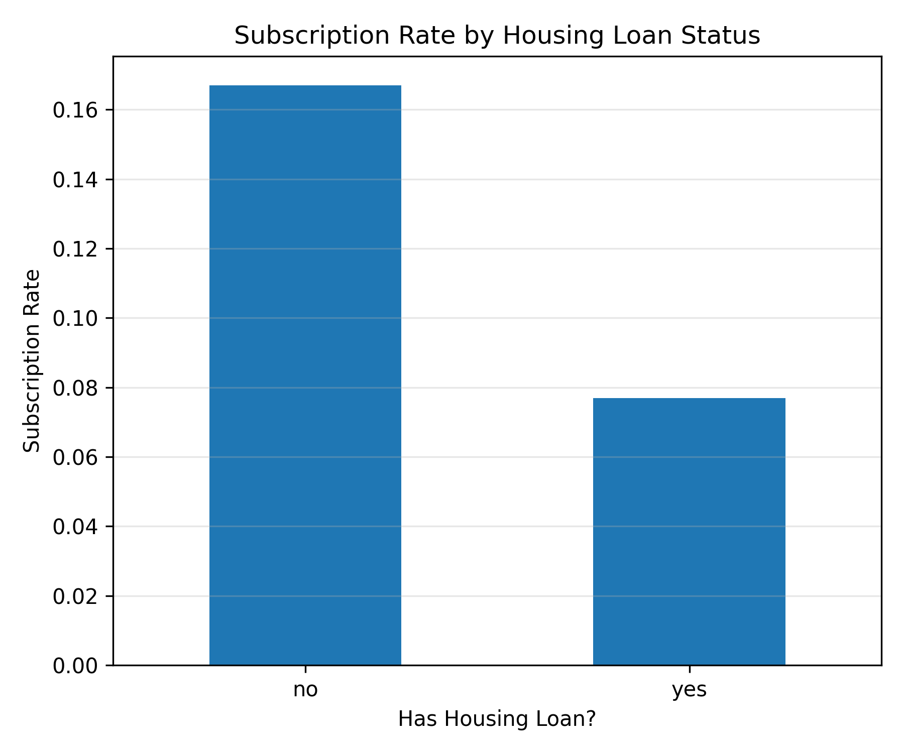

### Personal Loans

Customers with **personal loans** also exhibit lower subscription probabilities compared with those without personal loans.

This reinforces the idea that **existing debt obligations influence financial decision-making**.

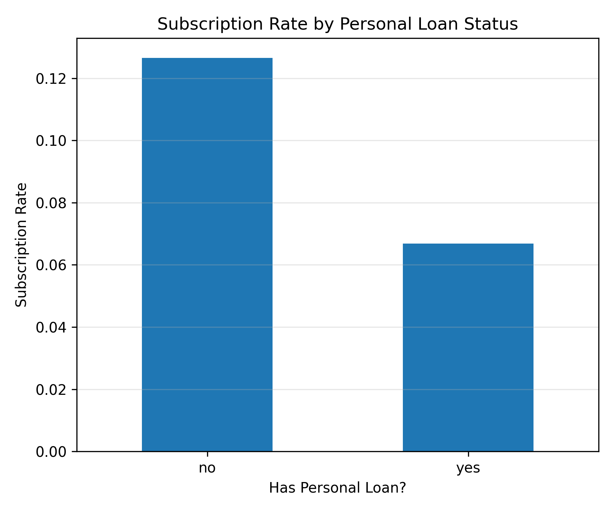

### Credit Default Status

Customers with **credit in default** show extremely low subscription rates.

This segment represents a clear **low-priority group for marketing outreach**.

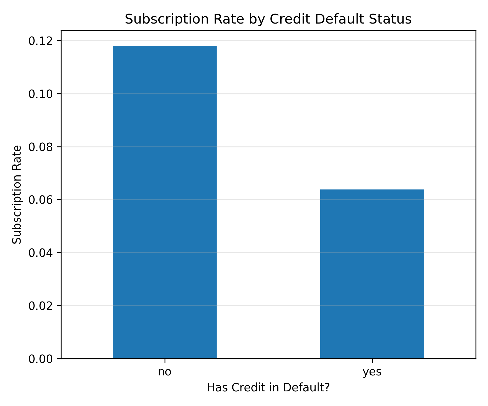

### Balance and Loan Interaction

When balance is combined with loan status, patterns become clearer.

The strongest conversion rates appear among customers who:

* **have high balances**

* **do not carry housing loans**

This combination represents one of the **most promising financial profiles for targeting term deposit offers**.

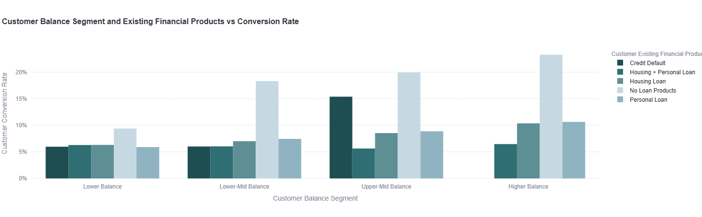

## 3. Campaign and Previous Contact Behavior

### Seasonal Patterns

Campaign performance varies across months.

Key observations:

* **March shows the highest subscription rates**
 
* **September, October, and December** also show relatively strong performance
 
* Other months show moderate or lower success rates

This suggests that **seasonality may influence customer responsiveness to marketing campaigns.**

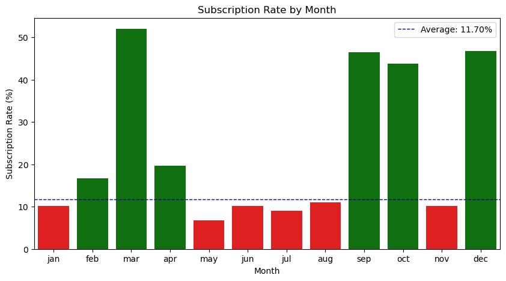

### Call Duration

Call duration shows a strong correlation with subscription success.

Longer calls are more likely to result in successful subscriptions. However, this variable cannot be used in predictive targeting because **call duration is only known after the call occurs**, making it a **data leakage variable**.

Therefore, it is used only for **behavioral interpretation rather than predictive modeling**.

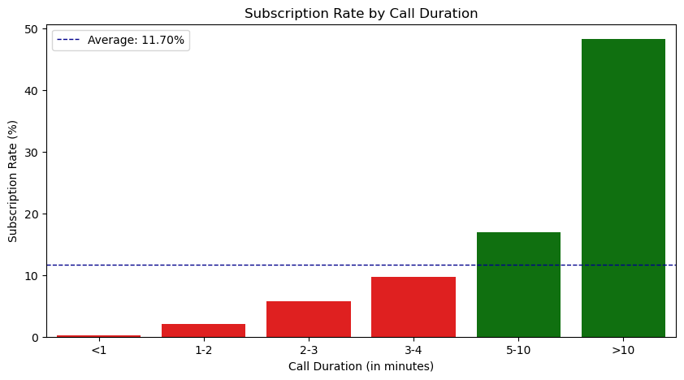

### Previous Campaign Outcome

Previous campaign outcomes provide one of the strongest predictors of subscription behavior.

Key findings include:

* Customers with **previous campaign success show dramatically higher subscription rates**

* Customers with **previous failures show much lower conversion probabilities**

This suggests that **retargeting previously successful customers may be highly effective.**

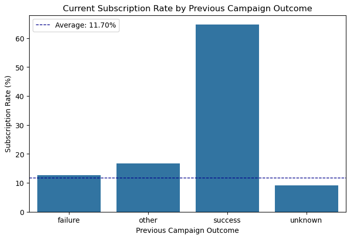

### Recency of Contact

The variable **pdays** measures the number of days since the last contact.

Key observation:

* Customers contacted **more recently show higher subscription probabilities**

* Conversion rates decline as the **time since last contact increases**

This highlights the importance of **recency in marketing engagement**.

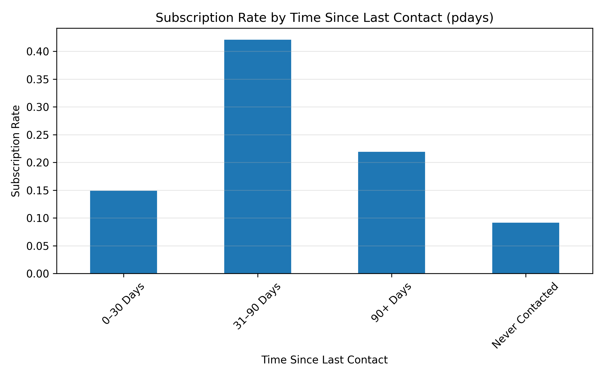

## 4. Customer Segmentation Analysis

Two-way segmentation analysis evaluates pairs of variables simultaneously, allowing us to identify:

* high-value target segments

* low-probability segments to avoid

### Top Target Segments

The **Top Target Segments** analysis identifies combinations of characteristics with **conversion rates significantly above the overall dataset average (11.7%)**.

Typical high-performing segments include:

* Customers **without housing loans and with high balances**

* Older customers **without major financial obligations**
 
* Customers with **strong financial profiles and favorable past campaign interactions**

These segments represent the **most promising customers for marketing outreach.**

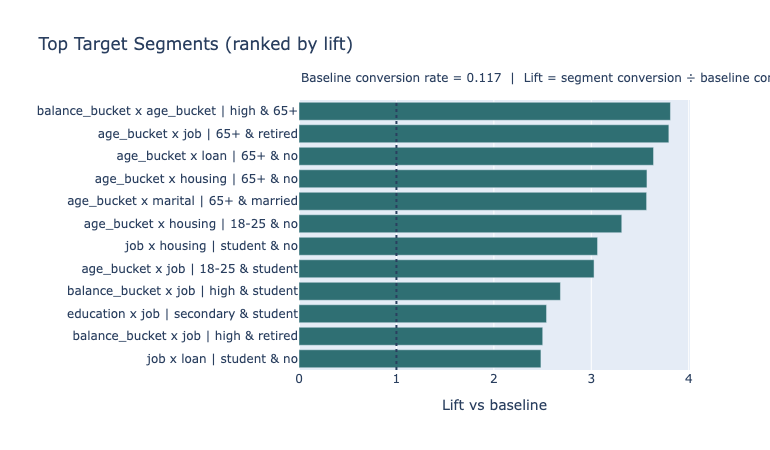

This visualization ranks segments by conversion rate and lift, helping marketers identify the most valuable customer groups.

### Segments to Avoid

The **Segments to Avoid** analysis highlights groups that consistently show very low subscription probabilities.

Typical low-performing segments include:

* Customers **with housing loans and low balances**

* Customers **with multiple financial obligations**
 
* Segments **with weak financial profiles**

Targeting these groups is unlikely to generate meaningful results and may reduce campaign efficiency.

Avoiding these segments allows marketing teams to:

* reduce unnecessary outreach

* improve campaign ROI
 
* allocate resources more effectively

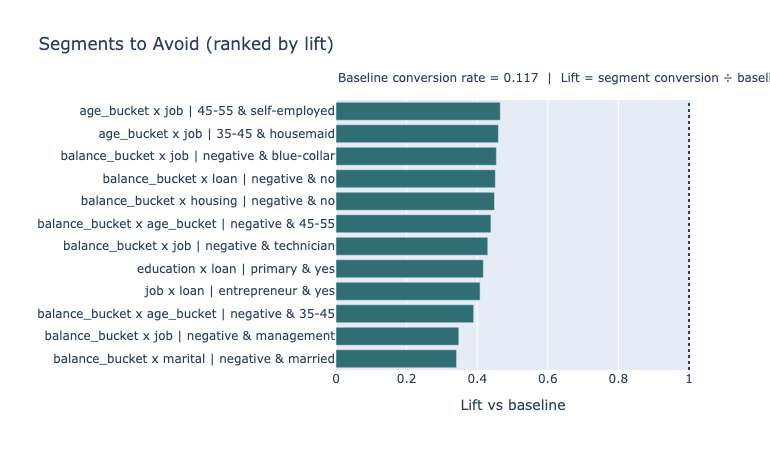

### Decision Table

To translate segmentation insights into actionable guidance, a decision table was created summarizing key segments and their marketing implications. This table provides a **clear operational guide for campaign targeting.**

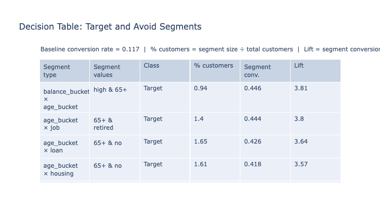

## 5. Summary of EDA Insights

* Older customers and retired segments show relatively higher subscription rates, though large working-age groups still account for most subscribers due to their population size.
 
* Financial profile is a strong indicator of subscription behavior. Customers with higher account balances are significantly more likely to subscribe, while customers with housing loans, personal loans, or credit default indicators show lower conversion rates.
 
* Previous campaign outcomes strongly influence future behavior. Customers who previously responded successfully to campaigns have much higher subscription probabilities.
 
* Two-way segmentation analysis helps identify meaningful customer groups, revealing segments with consistently high or low conversion rates.
 
* Segmentation highlights high-potential target segments (e.g., financially stronger customers without loan obligations) and low-probability segments that are less suitable for marketing outreach.
 
* Logistic regression enables customer-level probability ranking, allowing campaigns to prioritize customers most likely to subscribe.

## 6. Recommendations

* **Prioritize customers with stronger financial profiles**, particularly those with higher balances and fewer loan obligations.
 
* **Reduce outreach to low-probability segments**, such as customers with housing loans and low balances.
 
* **Retarget customers with previous successful campaign interactions**, as they show higher likelihood of subscribing again.
 
* **Use logistic regression ranking to prioritize outreach**, focusing marketing resources on the customers most likely to convert.

## Risks & Unknowns

This project includes several limitations that may affect the interpretation or real-world application of results.

### Risks
**Class Imbalance & Model Bias**

The dataset is heavily skewed toward customers who **did not subscribe**. This imbalance may cause models to favor predicting "no," reducing their ability to identify potential subscribers.

**Limited Generalizability**

The dataset originates from a **Portuguese bank**, and customer behavior, regulations, and financial habits may differ in other markets such as **Canada**.

**Outdated Data**

The data was collected before **2013**, and changes in customer expectations, economic conditions, and marketing channels may affect the relevance of findings today.

**Data Quality Issues**

Some fields contain **"unknown" values or unclear categories**, which may weaken interpretability and model performance.

**Outliers**

Extreme values in variables such as **account balance or call duration** may distort the analysis.

**Missing Important Variables**

Important behavioral drivers are not included in the dataset, such as:

* income
* digital engagement 
* geographic location
* psychological motivations

**Model Transferability**

A model trained on historical campaigns may not perform equally well on **new campaigns with different scripts or strategies.**

**Ethical & Consent Considerations**

It is unclear whether customers consented to repeated outreach, and predictive targeting may risk reinforcing **existing biases in historical data.**

**Correlation vs Causation**

Observed relationships represent a**ssociations rather than causal effects**, meaning the dataset cannot fully explain *why* customers subscribe.

### Unknowns

Several key business factors are not captured in the dataset.

**Campaign Costs & Profitability**

We do not know:

* the cost of each campaign
* the profit generated by successful subscriptions

This prevents accurate **ROI estimation**.

**Customer Motivations**

The dataset does not explain **why customers declined or accepted the offer**, limiting the ability to design improved messaging.

**Behavioral Context**

Important contextual factors such as:

* digital activity
* geographic location
* lifestyle characteristics

are not available.

**Customer Lifetime Value**

The dataset does not indicate:

* how long customers kept their term deposits
* long-term profitability of subscribers

**Loan Usage Details**

The dataset indicates whether a customer has a loan but does not show **how actively the loan is used**, which may influence financial behavior.

**Campaign Strategy Changes**

Information about **call scripts, targeting rules, and marketing strategies** is not included.

**External Economic Conditions**

Macroeconomic events that could influence financial decisions are not captured.

**Contact Timing**

The dataset does not include the **time of day customers were contacted**, which may affect response rates.

## Conclusion

This project demonstrates how data analysis and machine learning can support more effective marketing targeting for term deposit campaigns. Using the UCI Bank Marketing dataset, we combined **exploratory analysis, customer segmentation, and predictive modeling** to identify the factors that influence subscription behavior.

The analysis highlights that customers with **stronger financial profiles, fewer loan obligations, and positive previous campaign outcomes** are more likely to subscribe. Two-way segmentation helps identify **high-potential target segments and low-probability segments**, while logistic regression enables **customer-level probability ranking** to prioritize outreach.

Together, these approaches support a shift from **broad, high-volume outreach toward more targeted and data-driven marketing strategies**, helping improve campaign efficiency and reduce unnecessary contacts. The results are presented through an **interactive Streamlit dashboard**, which allows stakeholders to explore segmentation insights and model outputs in a user-friendly way.

