[comment]: #(this version is results for bank_addition_full.csv - not applicable for this project anymore)

## 1. Which age groups are most likely to subscribe to a term deposit?
- Likelihood within each age group <-- finding groups more liekly to subscribe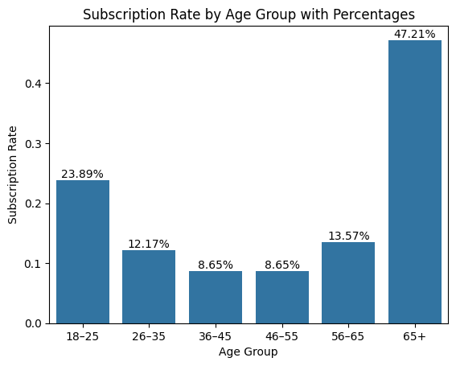
- Volume: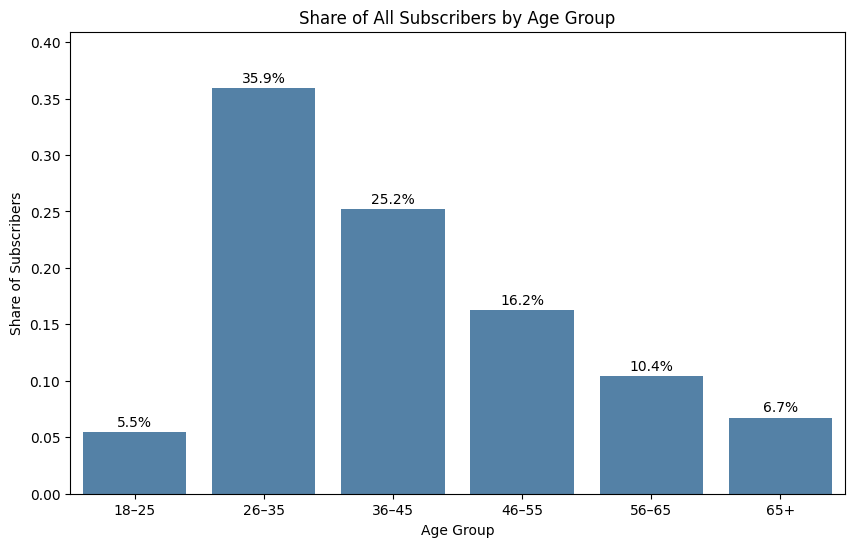

### Summary: 
- Age 65+ customers has higher conversion rate/potention 
- Age 26-45 is a larger group but has low responsiveness

## 2. Are retired customers more likely to subscribe than working professionals?
- Likelihood: 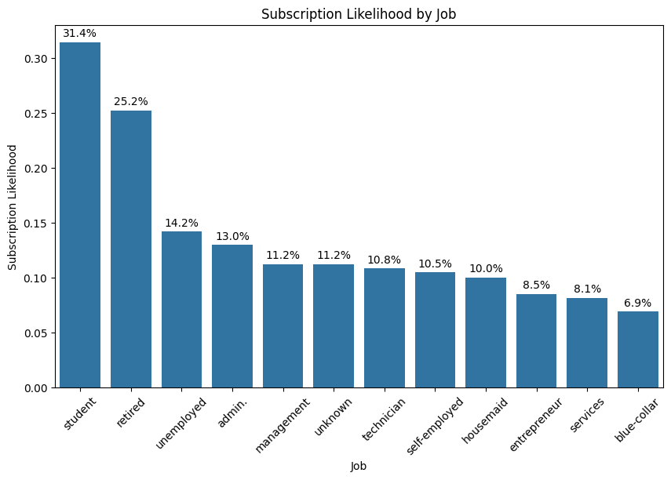
- Volumne: 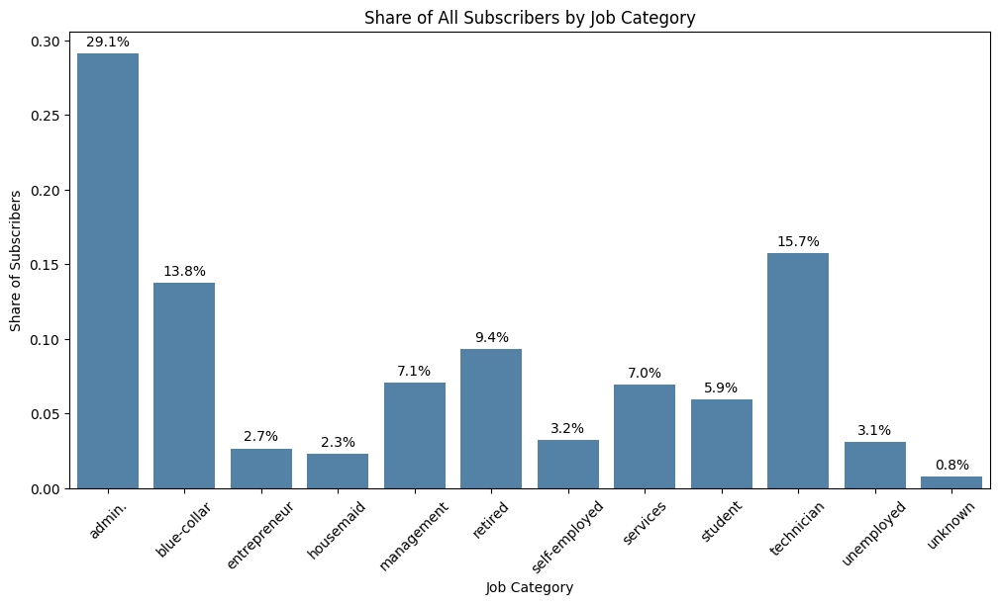
### Summary:
- Students and Retired customers are high-likelihood segments but not the largest groups 
- Admin, Technician, and Blue-collar are large groups, but only Admin and Technician have moderdate likelihood
    - Blue-color remains low-likelihood
- Unemployed customers show surprisely high likelihood relative to their size

## 3. Does a customer's age and job jointly infuence the probability of subscription?
Dual Heatmap (Likelihood + Sample Size) 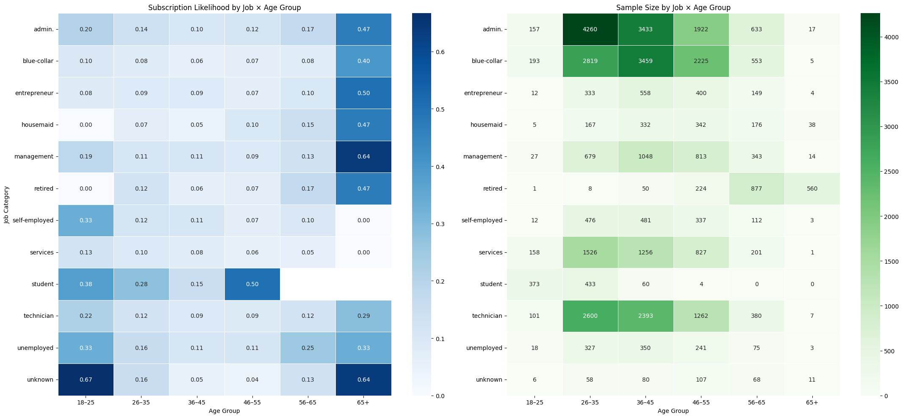
- left-side graph: Subscription Likelihood
- right-side graph: Sample size (counts)
### Summary:
- High-value segment(high likelihood+meaningful sample size):
    | Job          | Age Group      |
    |--------------|----------------|
    | Retired      | 56–65, 65+     |
    | Management   | 56–65          |
    | Technician   | 56–65          |
    | Student      | 18–25, 26–35   |

- Improvement Opportunities (large but low-likelihood segments):
    | Job          | Age Group                |
    |--------------|--------------------------|
    | Blue-collar  | 26–35,36–45, 46–55       |
    | Services     | 26–35,36–45, 46–55       |
    | Admin        | 26–35, 36–45             |
    | Technician   | 26–35, 36–45             |

- High-likelihood but tiny segments (statistical noise):
    | Job          | Age Group      |
    |--------------|----------------|
    | Entrepreneur | 65+            |
    | Housemaid    | 65+            |
    | Student      | 46–55          |
    | Unknown      | 18–25, 65+     |

    Remarks: threshold used in practice:
    * n < 20 → statistical noise (ignore)
    * 20 ≤ n < 50 → unstable but usable with caution
    * n ≥ 50 → reasonably stable
    * n ≥ 200 → very stable and reliable
### Conclusion:
the heatmap confirms that job and age interact strongly, and the most valuable segments are:
- older professional groups (management, admin, technician)
- Retired customers
- Younger students

While, blue-collar and services remain low-response across most ages, even though they are large groups

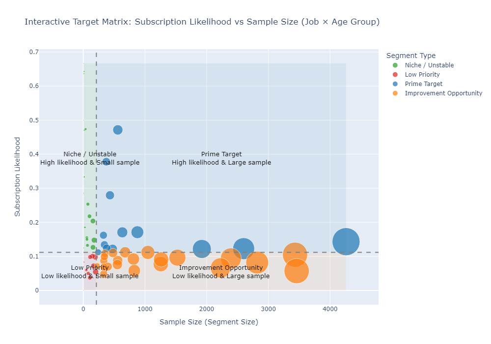
[Click here for the interactive version](target_matrix.html)
## 4. Does a customer's education level impact subscription?
- Likelihood: 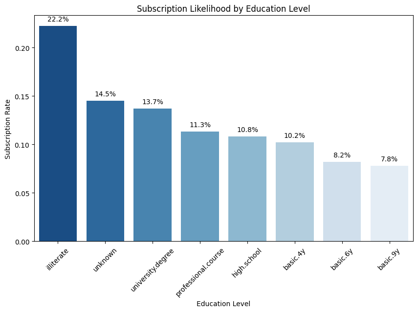
    * Less-educated customers tend to be more responsive to term deposit offers
        - Illiterate/unknown grpus are extremely small --> likelihood is inflated by small sample size
        - Lower-education groups maybe more risk-averse --> term deposits feel safe
    * Higher-education groups may prefer more complex / higher-yield financial products
- Volume: 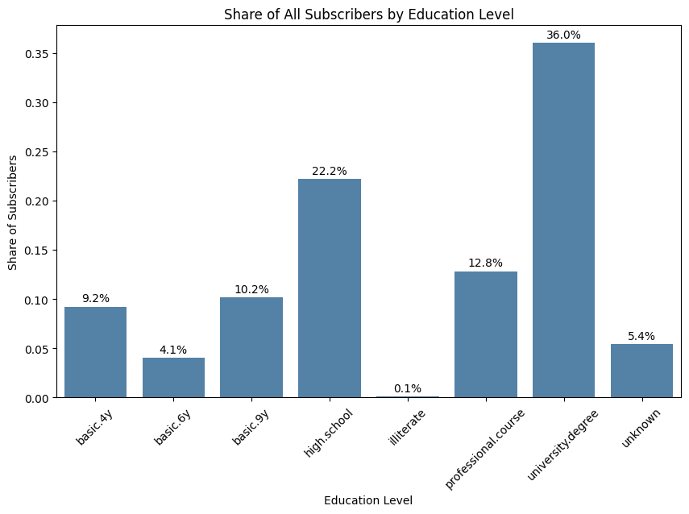
    * Largest share of subscribers comes from higher-education groups
        - Even though lower-education groups have higher likelihood, they are too small to matter in total volume
### Summary:
Yes, education level impacts subscription, but in 2 different ways:
- Likelihood decreases as education increases
- Volume increases as education increases
> Groups most likely to subscribe are not the groups that contribute the most subscribers
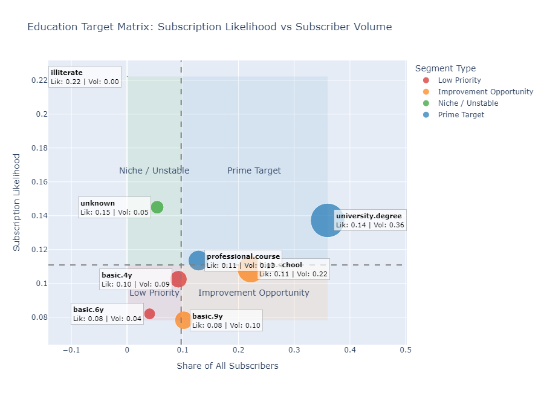
[Click here for the interactive version](education_target_matrix.html)

## 5. How does marital status impact subscription behavior?
- Likelihood: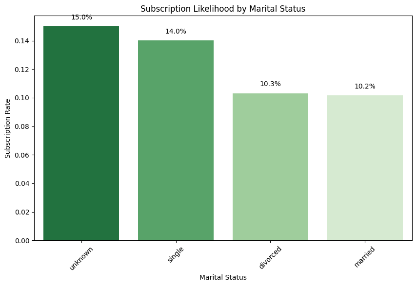
    * Singles are meaningfully more responsive than married or divorcced customers
        * Single individuals may be more open to financial products or more reachable by marketing channels
    * The 'unknown' group is small and unstable - its high rate is likely due to small sample size or data quality issues
- Volume: 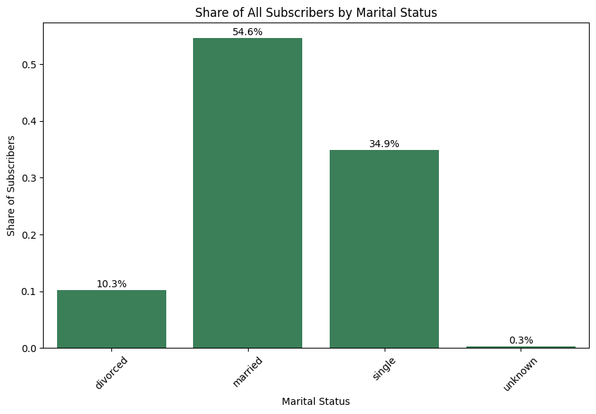
    * Though married customers have the lowest likelihood, they dominate total subscriber volume simply because they are the largest population group
    * Singles contribute a large share because they are both numerous and relatively responsive

### Summary:
Yes, marital status impacts subscription behaviour:
* Singles: most responsive meaningful group
* Married customers convert less often but dominate total subscribers due to population size
* Divorced customers are a mid-tier segment with room for improvement

Target Matrix:
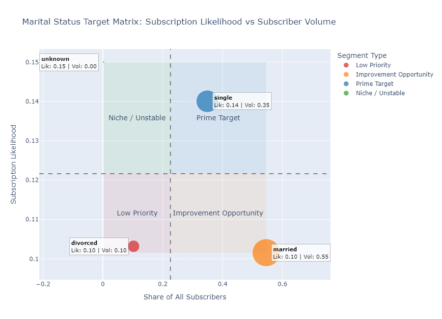

# Strategic Takeaway:
- Retired and student segments are high-conversion targets
- Admin and Technician are high-volume segments worth optimizing
- Blue-collar remains a low-response segment even with large volume <-- need rethink if worth targeting them

---
## Prime Target
| age_group   | job           | education           | marital   |   likelihood |   volume |   sample_size |   priority_score | quadrant     |
|:------------|:--------------|:--------------------|:----------|-------------:|---------:|--------------:|-----------------:|:-------------|
| 65+         | retired       | basic.4y            | married   |     0.517857 |       87 |           168 |         2.65655  | Prime Target |
| 18�25       | student       | high.school         | single    |     0.347826 |       64 |           184 |         1.81578  | Prime Target |
| 26�35       | student       | high.school         | single    |     0.309211 |       47 |           152 |         1.55546  | Prime Target |
| 26�35       | admin.        | university.degree   | single    |     0.163636 |      252 |          1540 |         1.20112  | Prime Target |
| 56�65       | retired       | high.school         | married   |     0.235772 |       29 |           123 |         1.13649  | Prime Target |
| 26�35       | admin.        | high.school         | single    |     0.16839  |      114 |           677 |         1.09776  | Prime Target |
| 56�65       | retired       | university.degree   | married   |     0.224806 |       29 |           129 |         1.09425  | Prime Target |
| 26�35       | technician    | university.degree   | single    |     0.16826  |       88 |           523 |         1.05356  | Prime Target |
| 46�55       | admin.        | university.degree   | married   |     0.16     |       88 |           550 |         1.00988  | Prime Target |
| 56�65       | admin.        | high.school         | married   |     0.198473 |       26 |           131 |         0.969106 | Prime Target |
| 26�35       | admin.        | university.degree   | married   |     0.140904 |      134 |           951 |         0.966401 | Prime Target |
| 56�65       | retired       | basic.4y            | married   |     0.18     |       36 |           200 |         0.954595 | Prime Target |
| 36�45       | admin.        | university.degree   | married   |     0.128876 |      133 |          1032 |         0.894428 | Prime Target |
| 56�65       | admin.        | university.degree   | married   |     0.157609 |       29 |           184 |         0.822773 | Prime Target |
| 26�35       | self-employed | university.degree   | single    |     0.15625  |       30 |           192 |         0.822295 | Prime Target |
| 56�65       | management    | university.degree   | married   |     0.154696 |       28 |           181 |         0.80504  | Prime Target |
| 26�35       | technician    | professional.course | single    |     0.126095 |       72 |           571 |         0.800592 | Prime Target |
| 26�35       | management    | university.degree   | single    |     0.136    |       34 |           250 |         0.751462 | Prime Target |
| 26�35       | technician    | professional.course | married   |     0.11976  |       60 |           501 |         0.744743 | Prime Target |
| 36�45       | technician    | university.degree   | married   |     0.130435 |       39 |           299 |         0.743972 | Prime Target |
| 36�45       | management    | university.degree   | married   |     0.113139 |       62 |           548 |         0.71369  | Prime Target |
| 26�35       | blue-collar   | high.school         | single    |     0.130045 |       29 |           223 |         0.703757 | Prime Target |
| 46�55       | admin.        | university.degree   | single    |     0.133758 |       21 |           157 |         0.677162 | Prime Target |
| 36�45       | admin.        | university.degree   | single    |     0.104425 |       59 |           565 |         0.661906 | Prime Target |
| 46�55       | management    | university.degree   | married   |     0.107981 |       46 |           426 |         0.654019 | Prime Target |
| 46�55       | admin.        | high.school         | divorced  |     0.133858 |       17 |           127 |         0.649484 | Prime Target |
| 36�45       | admin.        | university.degree   | divorced  |     0.119469 |       27 |           226 |         0.648113 | Prime Target |
| 36�45       | self-employed | university.degree   | married   |     0.128571 |       18 |           140 |         0.636269 | Prime Target |
| 26�35       | admin.        | high.school         | married   |     0.101124 |       54 |           534 |         0.635285 | Prime Target |
| 56�65       | technician    | professional.course | married   |     0.130081 |       16 |           123 |         0.627028 | Prime Target |
| 26�35       | services      | high.school         | single    |     0.101952 |       47 |           461 |         0.625535 | Prime Target |
| 26�35       | management    | university.degree   | married   |     0.111524 |       30 |           269 |         0.624359 | Prime Target |
| 46�55       | entrepreneur  | university.degree   | married   |     0.125    |       16 |           128 |         0.607477 | Prime Target |
| 46�55       | technician    | university.degree   | married   |     0.117241 |       17 |           145 |         0.584285 | Prime Target |
| 36�45       | technician    | high.school         | married   |     0.111111 |       19 |           171 |         0.571944 | Prime Target |
| 26�35       | self-employed | university.degree   | married   |     0.118644 |       14 |           118 |         0.567015 | Prime Target |
| 46�55       | admin.        | university.degree   | divorced  |     0.102881 |       25 |           243 |         0.565552 | Prime Target |
| 26�35       | technician    | high.school         | single    |     0.104651 |       18 |           172 |         0.539298 | Prime Target |
| 36�45       | entrepreneur  | university.degree   | married   |     0.107383 |       16 |           149 |         0.538055 | Prime Target |
| 36�45       | admin.        | high.school         | divorced  |     0.102703 |       19 |           185 |         0.536698 | Prime Target |
| 26�35       | admin.        | university.degree   | divorced  |     0.100775 |       13 |           129 |         0.490527 | Prime Target |

## Improvement Opportunity
| age_group   | job           | education           | marital   |   likelihood |   volume |   sample_size |   priority_score | quadrant                |
|:------------|:--------------|:--------------------|:----------|-------------:|---------:|--------------:|-----------------:|:------------------------|
| 36�45       | technician    | professional.course | married   |    0.095675  |       73 |           763 |         0.635145 | Improvement Opportunity |
| 46�55       | admin.        | high.school         | married   |    0.0984456 |       38 |           386 |         0.586581 | Improvement Opportunity |
| 36�45       | admin.        | high.school         | single    |    0.0985507 |       34 |           345 |         0.576171 | Improvement Opportunity |
| 36�45       | admin.        | high.school         | married   |    0.0868902 |       57 |           656 |         0.563716 | Improvement Opportunity |
| 46�55       | technician    | professional.course | married   |    0.0903491 |       44 |           487 |         0.559289 | Improvement Opportunity |
| 26�35       | services      | high.school         | married   |    0.0826923 |       43 |           520 |         0.517302 | Improvement Opportunity |
| 36�45       | technician    | university.degree   | single    |    0.093617  |       22 |           235 |         0.511508 | Improvement Opportunity |
| 26�35       | blue-collar   | basic.6y            | married   |    0.0888158 |       27 |           304 |         0.508054 | Improvement Opportunity |
| 36�45       | blue-collar   | basic.9y            | single    |    0.0965909 |       17 |           176 |         0.499969 | Improvement Opportunity |
| 36�45       | technician    | professional.course | single    |    0.0845481 |       29 |           343 |         0.493815 | Improvement Opportunity |
| 46�55       | blue-collar   | basic.6y            | married   |    0.0864198 |       21 |           243 |         0.475064 | Improvement Opportunity |
| 26�35       | blue-collar   | high.school         | married   |    0.0962963 |       13 |           135 |         0.47307  | Improvement Opportunity |
| 36�45       | services      | high.school         | married   |    0.0746004 |       42 |           563 |         0.472597 | Improvement Opportunity |
| 26�35       | blue-collar   | basic.9y            | married   |    0.0681551 |       58 |           851 |         0.459883 | Improvement Opportunity |
| 46�55       | technician    | high.school         | married   |    0.0902256 |       12 |           133 |         0.44191  | Improvement Opportunity |
| 56�65       | blue-collar   | basic.4y            | married   |    0.0791667 |       19 |           240 |         0.434213 | Improvement Opportunity |
| 26�35       | technician    | university.degree   | married   |    0.0739645 |       25 |           338 |         0.430917 | Improvement Opportunity |
| 46�55       | blue-collar   | basic.9y            | married   |    0.0666667 |       40 |           600 |         0.426573 | Improvement Opportunity |
| 36�45       | services      | high.school         | single    |    0.0818713 |       14 |           171 |         0.421432 | Improvement Opportunity |
| 26�35       | blue-collar   | basic.9y            | single    |    0.0681818 |       30 |           440 |         0.415162 | Improvement Opportunity |
| 26�35       | technician    | high.school         | married   |    0.0814815 |       11 |           135 |         0.40029  | Improvement Opportunity |
| 36�45       | technician    | professional.course | divorced  |    0.0769231 |       13 |           169 |         0.395061 | Improvement Opportunity |
| 46�55       | housemaid     | basic.4y            | married   |    0.0791367 |       11 |           139 |         0.391065 | Improvement Opportunity |
| 36�45       | blue-collar   | basic.9y            | married   |    0.0565445 |       54 |           955 |         0.388051 | Improvement Opportunity |
| 36�45       | blue-collar   | basic.6y            | married   |    0.0568384 |       32 |           563 |         0.360074 | Improvement Opportunity |
| 36�45       | services      | high.school         | divorced  |    0.0731707 |        9 |           123 |         0.352704 | Improvement Opportunity |
| 46�55       | blue-collar   | basic.4y            | married   |    0.0527086 |       36 |           683 |         0.34408  | Improvement Opportunity |
| 46�55       | services      | high.school         | married   |    0.0494505 |       18 |           364 |         0.291753 | Improvement Opportunity |
| 36�45       | blue-collar   | basic.9y            | divorced  |    0.057554  |        8 |           139 |         0.284411 | Improvement Opportunity |
| 36�45       | blue-collar   | basic.4y            | married   |    0.0429936 |       27 |           628 |         0.277057 | Improvement Opportunity |
| 36�45       | blue-collar   | professional.course | married   |    0.0551181 |        7 |           127 |         0.267435 | Improvement Opportunity |
| 26�35       | blue-collar   | basic.4y            | married   |    0.0471014 |       13 |           276 |         0.264899 | Improvement Opportunity |
| 26�35       | blue-collar   | basic.4y            | single    |    0.0542636 |        7 |           129 |         0.26413  | Improvement Opportunity |
| 36�45       | blue-collar   | high.school         | married   |    0.0485437 |       10 |           206 |         0.25887  | Improvement Opportunity |
| 56�65       | blue-collar   | basic.9y            | married   |    0.0507246 |        7 |           138 |         0.250299 | Improvement Opportunity |
| 36�45       | blue-collar   | unknown             | married   |    0.037594  |        5 |           133 |         0.184129 | Improvement Opportunity |
| 46�55       | self-employed | university.degree   | married   |    0.0344828 |        4 |           116 |         0.164213 | Improvement Opportunity |

## Niche / Unstable
| age_group   | job           | education           | marital   |   likelihood |   volume |   sample_size |   priority_score | quadrant         |
|:------------|:--------------|:--------------------|:----------|-------------:|---------:|--------------:|-----------------:|:-----------------|
| 65+         | retired       | basic.4y            | divorced  |     0.483146 |       43 |            89 |         2.17407  | Niche / Unstable |
| 18�25       | student       | unknown             | single    |     0.472222 |       34 |            72 |         2.02605  | Niche / Unstable |
| 65+         | retired       | professional.course | married   |     0.470588 |       24 |            51 |         1.85941  | Niche / Unstable |
| 65+         | retired       | university.degree   | married   |     0.423729 |       25 |            59 |         1.73489  | Niche / Unstable |
| 18�25       | student       | basic.9y            | single    |     0.365385 |       19 |            52 |         1.45068  | Niche / Unstable |
| 26�35       | student       | unknown             | single    |     0.294118 |       20 |            68 |         1.24533  | Niche / Unstable |
| 26�35       | unemployed    | university.degree   | single    |     0.253731 |       17 |            67 |         1.07062  | Niche / Unstable |
| 26�35       | student       | university.degree   | single    |     0.207207 |       23 |           111 |         0.977707 | Niche / Unstable |
| 56�65       | retired       | professional.course | married   |     0.205607 |       22 |           107 |         0.962681 | Niche / Unstable |
| 56�65       | housemaid     | basic.4y            | married   |     0.186813 |       17 |            91 |         0.84473  | Niche / Unstable |
| 26�35       | technician    | basic.9y            | single    |     0.196429 |       11 |            56 |         0.794171 | Niche / Unstable |
| 36�45       | management    | university.degree   | single    |     0.164835 |       15 |            91 |         0.74535  | Niche / Unstable |
| 36�45       | self-employed | university.degree   | single    |     0.180328 |       11 |            61 |         0.744237 | Niche / Unstable |
| 36�45       | management    | university.degree   | divorced  |     0.168831 |       13 |            77 |         0.735548 | Niche / Unstable |
| 26�35       | services      | basic.9y            | married   |     0.164557 |       13 |            79 |         0.721093 | Niche / Unstable |
| 36�45       | blue-collar   | high.school         | single    |     0.156627 |       13 |            83 |         0.693983 | Niche / Unstable |
| 26�35       | services      | university.degree   | single    |     0.164179 |       11 |            67 |         0.692755 | Niche / Unstable |
| 26�35       | admin.        | professional.course | single    |     0.166667 |        9 |            54 |         0.667889 | Niche / Unstable |
| 46�55       | admin.        | unknown             | married   |     0.163636 |        9 |            55 |         0.658694 | Niche / Unstable |
| 46�55       | technician    | basic.9y            | married   |     0.142857 |       10 |            70 |         0.608954 | Niche / Unstable |
| 36�45       | unemployed    | university.degree   | married   |     0.142857 |        8 |            56 |         0.577579 | Niche / Unstable |
| 18�25       | services      | high.school         | single    |     0.125    |       12 |            96 |         0.571839 | Niche / Unstable |
| 26�35       | blue-collar   | basic.6y            | single    |     0.121212 |       12 |            99 |         0.558202 | Niche / Unstable |
| 56�65       | self-employed | university.degree   | married   |     0.14     |        7 |            50 |         0.550456 | Niche / Unstable |
| 56�65       | admin.        | university.degree   | divorced  |     0.128571 |        9 |            70 |         0.548059 | Niche / Unstable |
| 36�45       | self-employed | basic.9y            | married   |     0.125    |        9 |            72 |         0.536307 | Niche / Unstable |
| 46�55       | retired       | basic.4y            | married   |     0.12963  |        7 |            54 |         0.519469 | Niche / Unstable |
| 46�55       | blue-collar   | basic.9y            | single    |     0.127273 |        7 |            55 |         0.512317 | Niche / Unstable |
| 26�35       | entrepreneur  | university.degree   | single    |     0.127273 |        7 |            55 |         0.512317 | Niche / Unstable |
| 56�65       | entrepreneur  | university.degree   | married   |     0.12069  |        7 |            58 |         0.492117 | Niche / Unstable |
| 26�35       | technician    | professional.course | divorced  |     0.106383 |       10 |            94 |         0.484455 | Niche / Unstable |
| 46�55       | admin.        | high.school         | single    |     0.111111 |        8 |            72 |         0.476718 | Niche / Unstable |
| 46�55       | blue-collar   | high.school         | married   |     0.104167 |       10 |            96 |         0.476532 | Niche / Unstable |
| 56�65       | retired       | basic.9y            | married   |     0.117647 |        6 |            51 |         0.464852 | Niche / Unstable |
| 26�35       | technician    | basic.9y            | married   |     0.111111 |        7 |            63 |         0.462098 | Niche / Unstable |
| 26�35       | entrepreneur  | university.degree   | married   |     0.106667 |        8 |            75 |         0.461945 | Niche / Unstable |
| 46�55       | management    | basic.9y            | married   |     0.115385 |        6 |            52 |         0.458111 | Niche / Unstable |

## Low Priority
| age_group   | job           | education           | marital   |   likelihood |   volume |   sample_size |   priority_score | quadrant     |
|:------------|:--------------|:--------------------|:----------|-------------:|---------:|--------------:|-----------------:|:-------------|
| 26�35       | blue-collar   | professional.course | married   |    0.0989011 |        9 |            91 |        0.44721   | Low Priority |
| 46�55       | management    | university.degree   | divorced  |    0.0952381 |       10 |           105 |        0.444137  | Low Priority |
| 36�45       | services      | basic.6y            | married   |    0.1       |        6 |            60 |        0.411087  | Low Priority |
| 18�25       | blue-collar   | basic.9y            | single    |    0.0897436 |        7 |            78 |        0.39213   | Low Priority |
| 18�25       | admin.        | high.school         | single    |    0.09375   |        6 |            64 |        0.391349  | Low Priority |
| 36�45       | technician    | university.degree   | divorced  |    0.0980392 |        5 |            51 |        0.387377  | Low Priority |
| 26�35       | admin.        | basic.9y            | single    |    0.0853659 |        7 |            82 |        0.377218  | Low Priority |
| 26�35       | services      | professional.course | married   |    0.0943396 |        5 |            53 |        0.376319  | Low Priority |
| 46�55       | unemployed    | high.school         | married   |    0.0925926 |        5 |            54 |        0.371049  | Low Priority |
| 46�55       | technician    | university.degree   | divorced  |    0.0909091 |        5 |            55 |        0.365941  | Low Priority |
| 46�55       | blue-collar   | professional.course | married   |    0.0786517 |        7 |            89 |        0.353918  | Low Priority |
| 26�35       | blue-collar   | basic.9y            | divorced  |    0.0847458 |        5 |            59 |        0.346978  | Low Priority |
| 46�55       | blue-collar   | unknown             | married   |    0.0714286 |        8 |           112 |        0.337671  | Low Priority |
| 46�55       | admin.        | basic.9y            | married   |    0.0695652 |        8 |           115 |        0.330685  | Low Priority |
| 36�45       | blue-collar   | basic.6y            | single    |    0.075     |        6 |            80 |        0.329584  | Low Priority |
| 46�55       | management    | high.school         | married   |    0.0724638 |        5 |            69 |        0.307862  | Low Priority |
| 46�55       | self-employed | basic.9y            | married   |    0.0769231 |        4 |            52 |        0.305407  | Low Priority |
| 36�45       | technician    | high.school         | single    |    0.0674157 |        6 |            89 |        0.303358  | Low Priority |
| 36�45       | unemployed    | basic.9y            | married   |    0.0727273 |        4 |            55 |        0.292753  | Low Priority |
| 26�35       | services      | basic.9y            | single    |    0.0727273 |        4 |            55 |        0.292753  | Low Priority |
| 36�45       | entrepreneur  | high.school         | married   |    0.0675676 |        5 |            74 |        0.291722  | Low Priority |
| 46�55       | blue-collar   | basic.4y            | divorced  |    0.0561798 |        5 |            89 |        0.252798  | Low Priority |
| 46�55       | technician    | professional.course | divorced  |    0.0521739 |        6 |           115 |        0.248013  | Low Priority |
| 36�45       | technician    | basic.9y            | married   |    0.0531915 |        5 |            94 |        0.242227  | Low Priority |
| 46�55       | services      | high.school         | divorced  |    0.0505051 |        5 |            99 |        0.232584  | Low Priority |
| 36�45       | management    | high.school         | married   |    0.049505  |        5 |           101 |        0.228959  | Low Priority |
| 46�55       | services      | basic.9y            | married   |    0.0566038 |        3 |            53 |        0.225792  | Low Priority |
| 26�35       | admin.        | basic.9y            | married   |    0.0566038 |        3 |            53 |        0.225792  | Low Priority |
| 36�45       | admin.        | professional.course | married   |    0.0454545 |        4 |            88 |        0.204029  | Low Priority |
| 56�65       | services      | high.school         | married   |    0.0444444 |        4 |            90 |        0.200483  | Low Priority |
| 46�55       | unknown       | unknown             | married   |    0.0392157 |        2 |            51 |        0.154951  | Low Priority |
| 26�35       | services      | high.school         | divorced  |    0.0344828 |        3 |            87 |        0.154391  | Low Priority |
| 46�55       | entrepreneur  | basic.9y            | married   |    0.0363636 |        2 |            55 |        0.146376  | Low Priority |
| 36�45       | admin.        | basic.9y            | married   |    0.0253165 |        2 |            79 |        0.110937  | Low Priority |
| 36�45       | services      | basic.9y            | married   |    0.0238095 |        2 |            84 |        0.105777  | Low Priority |
| 26�35       | admin.        | high.school         | divorced  |    0.0215054 |        2 |            93 |        0.0977053 | Low Priority |
| 36�45       | housemaid     | basic.4y            | married   |    0.0188679 |        2 |           106 |        0.0881666 | Low Priority |
| 46�55       | blue-collar   | basic.9y            | divorced  |    0.0138889 |        1 |            72 |        0.0595897 | Low Priority |
| 36�45       | entrepreneur  | basic.9y            | married   |    0.0133333 |        1 |            75 |        0.0577431 | Low Priority |
| 36�45       | blue-collar   | basic.4y            | single    |    0.0103093 |        1 |            97 |        0.0472677 | Low Priority |